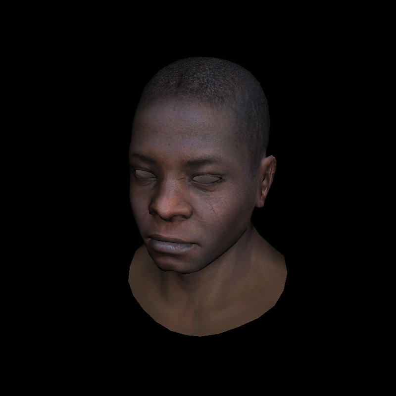

# rastaman: A software rasterizer written in Common Lisp.

This is a simple, software-only library for rendering 3d scenes, inspired by
Dmitry Sokolov's [wonderful
tutorial](https://github.com/ssloy/tinyrenderer/wiki/Lesson-0-getting-started).
The name is both a play on the word "rasterization" as well as a small tribute
to [Pixar's RenderMan](https://en.wikipedia.org/wiki/Pixar_RenderMan).

## Example

Here is a model rendered with simple lighting and texture.

